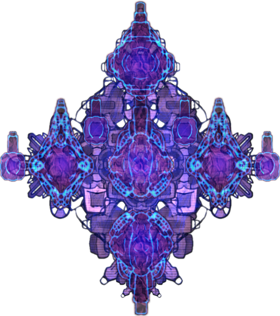
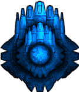

[![Contributors][contributors-shield]][contributors-url]
[![Forks][forks-shield]][forks-url]
[![Stargazers][stars-shield]][stars-url]
[![Issues][issues-shield]][issues-url]

<!-- PROJECT LOGO -->
<br />
<p align="center">
  <a href="https://github.com/e71az/phaser3-shooter-game" style="text-decoration: none;">
    
  </a>

  <h2 align="center">Ship Wrecker</h2>

  <h3 align="center">Javascript Project --> ship-wrecker<h3>
  <p align="center">
    <a href="#table-of-contents"><strong>Explore the docs »</strong></a>
    <br />
    <br />
    -
    <a href="https://github.com/e71az/phaser3-shooter-game/issues">Report a Bug</a>
    -
    <a href="https://github.com/e71az/phaser3-shooter-game/issues">Request a Feature</a>
    -
  </p>
</p>

<!-- TABLE OF CONTENTS -->

## Table of Contents

- [About the Project](#about-the-project)

  - [Screenshots](#screenshots)
  - [Demo Link](#demo-link)
  - [Video Explanation](#video-explanation)
  - [Assets Credits](#assets-credits)
  - [Controls](#controls)
  - [Prerequisites](#prerequisites)
  - [Installation](#installation)
  - [Automated Tests](#automated-tests)
  - [Enemies](#enemies)
  - [Built With](#built-with)

- [Contributors](#contributors)
- [Contributing](#contributing)
- [Show Your Support](#show-your-support)
- [License](#license)

<!-- ABOUT THE PROJECT -->

## About The Project

This is the **Ship Wrecker** Capstone project where users are able to fight for their life vs an army of invading spaceships that wont stop coming until you die! API usage for the scores was implemented, testing done with Mocha and game deployment done to Netlify.

## Screenshots


## Demo Link

[Live Demo Link](https://ship-wrecker.netlify.app/).

## Video Explanation

[Demo Video](https://www.loom.com/share/5d88bff6fbe043b4b9742282c184c936).

## Assets Credits

[GameSupply](https://gamesupply.itch.io)

## Controls

**Movement**

- W to displace upwards, S for downwards
- A to displace to the left, D to displace to the right
- Space bar to shoot

## Prerequisites

- npm
- Webpack
- Node.js
- JavaScript

## Installation

To get a local copy up and running follow these simple example steps:

- Clone this repository into your local machine

- Run:

```bash
  $ npm install
```

- Run:

```bash
  $ npm run start
```

- Enter in your web browser address bar:

  localhost:8080

- Wait for the game assets to load

- Click Play!

## Automated Tests

- Run the command and see the output

```
$ npm test
```

## Enemies

Gunship:

- The GunShip can fire at you, dodge its attacks at all cost!



Carrier:

- The Carrier is just doing its own thing, just ensure that you dont crash with it!



ChaserShip:

- The ChaserShip is one of the most dangerous enemies, it wont stop following you until you crash with it, careful with them!


### Built With

This project was built using these technologies:

- Javascript
- HTML
- Phaser 3
- Webpack
- Babel
- Leaderboard API
- Mocha testing
- Netlify
- ESlint and Stylelint as linters

## Contributors

👤 **Elias Castañeda**

- Github: [@e71az](https://github.com/e71az)
- Linkedin: [@e71az](https://www.linkedin.com/in/eliasecasta/)

## Contributing

:handshake:

Contributions, issues and feature requests are welcome!
Feel free to check the [issues page](https://github.com/e71az/phaser3-shooter-game/issues)

## Show your support

Give a :star: if you like this project!

<!-- MARKDOWN LINKS & IMAGES -->
<!-- https://www.markdownguide.org/basic-syntax/#reference-style-links -->

[contributors-shield]: https://img.shields.io/github/contributors/e71az/phaser3-shooter-game.svg?style=flat-square
[contributors-url]: https://github.com/e71az/phaser3-shooter-game/graphs/contributors
[forks-shield]: https://img.shields.io/github/forks/e71az/phaser3-shooter-game
[forks-url]: https://github.com/e71az/phaser3-shooter-game/network/members
[stars-shield]: https://img.shields.io/github/stars/e71az/phaser3-shooter-game
[stars-url]: https://github.com/e71az/phaser3-shooter-game/stargazers
[issues-shield]: https://img.shields.io/github/issues/e71az/phaser3-shooter-game.svg?style=flat-square
[issues-url]: https://github.com/e71az/phaser3-shooter-game/issues

## License

📝

This project is [MIT](https://opensource.org/licenses/MIT) licensed.
